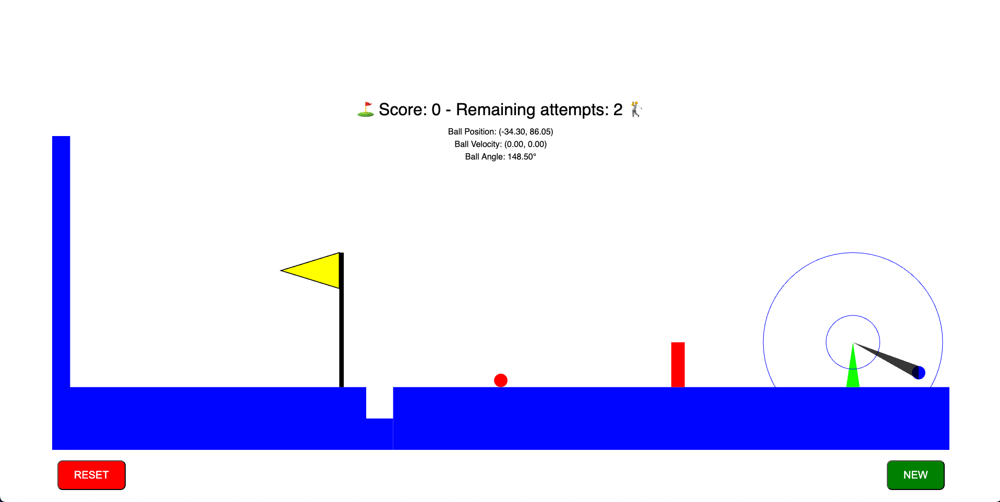

# Game Physics Project

> **Author**: Mathieu Wassmuth  
> **Date**: November, 2024

## Overview

This repository contains code for my game physics project for the **Advanced Games Physics** course at HTW Berlin. The project is a basic physics-based game, where a slingshot launches a ball to hit a target. This project aims to apply concepts like acceleration, friction, collisions, and scaling within a cartesian coordinate system, all while working with `p5.js`.

## Features

- **State Machine**: Manages game states (start, moving in air, moving on the plane, end).
- **Collision Detection**: Detects collisions with game objects like walls and obstacles.
- **Slingshot Mechanics**: Implements slingshot physics with adjustable angles and launch speeds.
- **Game UI**: Displays score, remaining attempts, and updates on game status.
- **Realistic Physics**:
  - Gravity and bounce effects for projectile motion
  - Friction for movement on the ground
  - Adjustable constants to change physics behavior

## Getting Started

To run this project locally, you need `p5.js`. Clone the repository, then open `index.html` in your browser to start the game.

### Prerequisites

- **p5.js**: [Download and install p5.js](https://p5js.org/download/)
- ## **This is included as a .js file in the repository**

### Installation

1. Clone this repository:
   ```bash
   git clone https://github.com/prodmatze/game_physics.git
2. Open `index.html` in your browser to run the game.

## Usage
- **NEW Button**: Starts a new attempt without resetting the score.
- **RESET Button**: Resets the game and score.

## Code Structure
- `main.js`: Main script handling game setup, states, and primary interactions.
- `collisions.j`: Manages collision detection for the ball, walls, ground, and obstacles.
- `interactivity.js`: Handles mouse controls for the slingshot and launching the ball.
- `addOns.js: Contains`: drawing functions for game elements like rectangles, triangles, and the flag.

## Game Physics
The project includes these physics-based concepts:
- Projectile Motion: Simulates a projectile launched at an adjustable angle.
- Friction and Bouncing: Provides realistic responses when the ball hits the ground or walls.
- Scaling: All objects are scaled based on a cartesian coordinate system, converting real-world units to the screen display.
- Objective: The goal is to hit the red ball and sink it into a hole to score points, similar to a basic target game

## Physics Constants
- **Gravity**: `981 cm/s²` - Controls the downward acceleration of the projectile (play_ball)
- **Bounce Factor**: `0.8` - Determines how much of the downward acceleration gets preserved after each bounce of the ball
- **Plane Friction**: `0.95` - Applies friction when the ball moves along the ground.

## Screenshots
**More screenshots will get shown here after completion of the project**

*Figure 1: Main game interface.*
